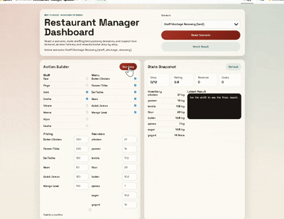

# Restaurant Manager OpenEnv

Restaurant Manager OpenEnv is a restaurant operations benchmark where an agent runs a 12-step shift inside an Indian restaurant setting. The agent has to balance staffing, menu availability, pricing, promotions, and emergency reorders while protecting service quality, ratings, and profitability.

This repository now includes:
- 8 distinct scenarios
- dense step rewards with stronger penalties for failures and inefficiency
- deterministic final grading
- a browser dashboard at `/` and `/play`
- OpenEnv-compatible packaging and validation



## What the agent controls

At every step, the agent receives the full restaurant state and chooses:

- `staff_changes`: call in or send home named staff members
- `menu_changes`: enable or disable menu items
- `price_adjustments`: raise or lower dish prices within guarded limits
- `reorder_inventory`: buy emergency stock at premium reorder prices
- `promotion_active`: run a discount promotion that increases demand

The simulation tracks:

- demand changes across the shift
- ingredient consumption and stockouts
- kitchen and server capacity constraints
- rating drift from service quality and pricing pressure
- labor, food, and reorder costs
- event-driven shocks such as large parties, inspections, delivery surges, and supplier delays

## Scenario Set

The environment includes 8 scenarios:

| ID | Difficulty | Core pressure |
|---|---|---|
| `weekday_lunch` | easy | predictable lunch peak and basic staffing discipline |
| `weekend_rush` | medium | damaged rating, surge demand, large party shock |
| `crisis_shift` | hard | doubled ingredient costs, low inventory, health inspection |
| `monsoon_delivery_crunch` | medium | rain-driven demand surge and supplier delay |
| `wedding_catering_chaos` | hard | premium evening demand, VIP visit, large party |
| `office_catering_lunch` | easy | concentrated corporate lunch throughput |
| `tourist_season_dinner` | medium | strong dinner demand with pricing sensitivity |
| `staff_shortage_recovery` | hard | under-staffed opening with weak inventory buffers |

## Reward and grading

The step reward is not just profit. It combines:

- normalized step profit
- customer rating trajectory
- service reliability

It then subtracts explicit penalties for:

- failed orders
- stockout failures
- capacity failures
- expensive emergency reorders
- inefficient labor usage when service remains weak

Final grading is deterministic and task-specific. The grader scores:

- `profit`
- `rating`
- `service`
- `satisfaction`
- `efficiency`

This makes the benchmark harder to game with one-dimensional strategies like permanent overpricing or overstaffing.

## Baseline Benchmarks

The repo includes a small rule-based benchmark runner:

```bash
venv/bin/python scripts/eval_baselines.py
```

Average score across all 8 tasks:

| Policy | Average score |
|---|---:|
| `profit_first` | 68.07 |
| `simple_rule` | 59.28 |
| `do_nothing` | 58.63 |
| `service_first` | 48.80 |

Task-level scores:

| Policy | Task | Score |
|---|---|---:|
| `do_nothing` | `weekday_lunch` | 77.85 |
| `do_nothing` | `weekend_rush` | 51.50 |
| `do_nothing` | `crisis_shift` | 56.96 |
| `do_nothing` | `monsoon_delivery_crunch` | 46.13 |
| `do_nothing` | `wedding_catering_chaos` | 55.93 |
| `do_nothing` | `office_catering_lunch` | 71.45 |
| `do_nothing` | `tourist_season_dinner` | 59.09 |
| `do_nothing` | `staff_shortage_recovery` | 50.14 |
| `simple_rule` | `weekday_lunch` | 71.38 |
| `simple_rule` | `weekend_rush` | 68.45 |
| `simple_rule` | `crisis_shift` | 34.19 |
| `simple_rule` | `monsoon_delivery_crunch` | 61.02 |
| `simple_rule` | `wedding_catering_chaos` | 55.16 |
| `simple_rule` | `office_catering_lunch` | 65.48 |
| `simple_rule` | `tourist_season_dinner` | 54.01 |
| `simple_rule` | `staff_shortage_recovery` | 64.53 |
| `profit_first` | `weekday_lunch` | 81.18 |
| `profit_first` | `weekend_rush` | 67.02 |
| `profit_first` | `crisis_shift` | 37.36 |
| `profit_first` | `monsoon_delivery_crunch` | 70.37 |
| `profit_first` | `wedding_catering_chaos` | 68.11 |
| `profit_first` | `office_catering_lunch` | 76.74 |
| `profit_first` | `tourist_season_dinner` | 67.50 |
| `profit_first` | `staff_shortage_recovery` | 76.27 |
| `service_first` | `weekday_lunch` | 60.41 |
| `service_first` | `weekend_rush` | 55.93 |
| `service_first` | `crisis_shift` | 38.27 |
| `service_first` | `monsoon_delivery_crunch` | 46.91 |
| `service_first` | `wedding_catering_chaos` | 44.77 |
| `service_first` | `office_catering_lunch` | 55.41 |
| `service_first` | `tourist_season_dinner` | 44.76 |
| `service_first` | `staff_shortage_recovery` | 43.98 |

## Browser UI

The environment ships with a browser dashboard:

```bash
venv/bin/uvicorn app:app --host 0.0.0.0 --port 7860
```

Open:

```text
http://localhost:7860/
```

The dashboard is also available at:

```text
http://localhost:7860/play
```

The dashboard lets you:

- select any scenario
- inspect the current state
- toggle staff and menu availability
- change prices
- submit inventory reorders
- run steps manually
- inspect event logs, rewards, and final scores

## Local setup

```bash
git clone https://github.com/sheetalll28/Restaurant-manager-openenv
cd Restaurant-manager-openenv

python -m venv venv
venv/bin/pip install -r requirements.txt
venv/bin/pip install pytest
```

Run the API server:

```bash
venv/bin/uvicorn app:app --host 0.0.0.0 --port 7860
```

Run inference:

```bash
HF_TOKEN=your_token python inference.py
```

Run one task:

```bash
HF_TOKEN=your_token TASK=crisis_shift VERBOSE=true python inference.py
```

## Validation and tests

Validate the environment:

```bash
openenv validate
```

Run tests:

```bash
venv/bin/python -m pytest -q
```

## Deployment

To push this environment to your Hugging Face Space:

```bash
set -a
source .env
set +a
openenv push . --repo-id your_huggingface_username/restaurant-manager-openenv
```

If the token is valid but push fails with a permissions error, the token likely exists but does not have write access to your namespace.

## API surface

Main endpoints:

- `GET /` browser dashboard
- `GET /play` browser dashboard alias
- `GET /status` JSON status metadata
- `GET /health` health check
- `POST /reset` start a scenario
- `POST /step` execute one action
- `GET /state` fetch current observation
- `GET /tasks` list scenario metadata
- `GET /result` fetch final score/result snapshot

Example:

```python
import httpx

r = httpx.post("http://localhost:7860/reset", json={"task_id": "weekend_rush"})
state = r.json()["observation"]

action = {
    "staff_changes": {"Priya": True, "Sneha": True, "Arjun": True},
    "menu_changes": {"Butter Chicken": True},
    "price_adjustments": {"Paneer Tikka": 295},
    "reorder_inventory": {"paneer": 2.0},
    "promotion_active": False,
}

r = httpx.post("http://localhost:7860/step", json=action)
print(r.json()["reward"], r.json()["done"])
```

## Project structure

```text
.
├── app.py
├── client.py
├── inference.py
├── models.py
├── openenv.yaml
├── README.md
├── scripts/
│   └── eval_baselines.py
├── ui/
│   ├── app.js
│   ├── index.html
│   └── styles.css
├── env/
│   ├── environment.py
│   ├── graders.py
│   ├── models.py
│   └── tasks.py
├── server/
│   ├── app.py
│   ├── Dockerfile
│   └── requirements.txt
└── tests/
    ├── test_environment.py
    └── test_models.py
```

## Submission checklist

Before submission, the high-signal checks are:

```bash
openenv validate
venv/bin/python -m pytest -q
openenv push . --repo-id your_huggingface_username/restaurant-manager-openenv
```
